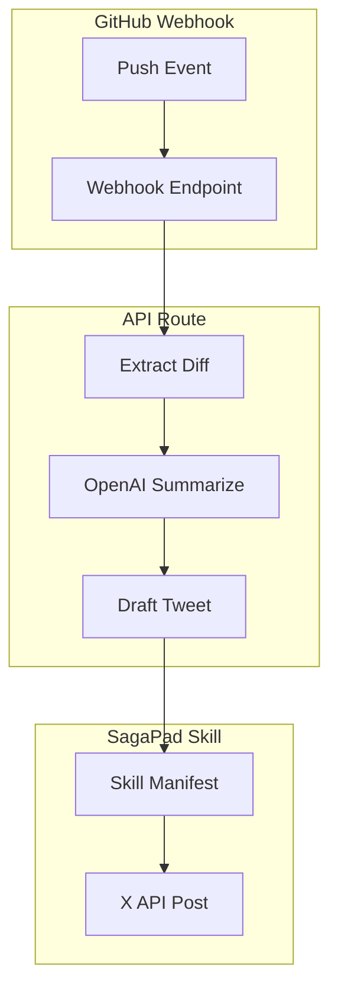

# Shiproof — Technical Architecture

## System Architecture

## Integration Map

| Feature | Use Case | Depth |
|---|---|---|
| **GitHub Webhook** | Listen for push events | 🟢 Core |
| **OpenAI Summarize** | Generate tweet from diff | 🟢 Core |
| **SagaPad Skill** | Register as installable skill | 🟢 Core |

## API Routes

| Method | Path | Description |
|---|---|---|
| POST | `/api/webhook/github` | Receive push event → draft tweet |
| GET | `/api/ships` | Recent "Proof of Ship" posts |
